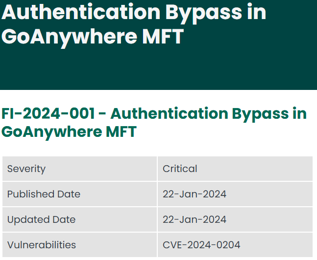

# PPS-Unidad2Actividad1-JulioManuel

# Trazado de una vulnerabilidad.
Tabajaremos con los Entornos de Desarrollo

Tenemos varios objetivos:

> [Obtener información de una vulnerabilidad navegando por las webs de los organismos que mantienen esas listas.](#Trazado)

---
## Trazado
Vamos a seguir el trazado de una vulnerabilidad a partir del [artículo del INCIBE](https://www.incibe.es/empresas/avisos/vulnerabilidad-critica-de-omision-de-autenticacion-en-goanywhere-mft-de-fortra).

Como vemos nos informa de una vulnerabilidad presente en la aplicación GoAnywhere MFT de Fortra.

Como en este artículo no nos dán información sobre el número de la vulnerabilidad, nos vamos al apartado de referencias, donde encontramos un enlace a la noticia publicada por el desarrollador:

Dándole al enlace nos lleva a la página: [https://www.fortra.com/security/advisories/product-security/fi-2024-001](https://www.fortra.com/security/advisories/product-security/fi-2024-001)

  

## Información sobre Vulnerabilidades

Además el desarrollador, nos informa de las versiones afectadas y que podemos hacer manualmente para arreglar la vulnerabilidad sin necesidad de actualizar.

  

  

Para ver información sobre dicha vulnerabilidad podemos acudir al menos a dos fuentes:

- [La sección de CVE que mantiene cve.org.](https://www.cve.org/CVERecord?id=CVE-2024-0204)

- [La base de datos de vulnerabilidades de la NIST: NVD.](https://nvd.nist.gov/vuln-metrics/cvss/v3-calculator?vector=AV:N/AC:L/PR:N/UI:N/S:U/C:H/I:H/A:H&version=3.1)

## Información sobre el riesgo o criticidad de una vulnerabilidad

Desde la [entrada correspondiente a la vulnerabilidad en la NVD](https://nvd.nist.gov/vuln-metrics/cvss/v3-calculator?vector=AV:N/AC:L/PR:N/UI:N/S:U/C:H/I:H/A:H&version=3.1), lo primero que nos encontramos, es la información de la criticidad que la vulnerabilidad presenta, así como el vector asociado a dicho nivel en la CVSS. En este caso vemos que tiene una valoración de 9.8, y está marcada como __crítica__.
 

  

Donde podemos ver que ese 9.8 de criticidad está compuesto por un valor de 3.9 de __las métricas de explotabilidad__:
- El vector de ataque se produce desde la red. 
- La complejidad de ataque es baja.
- No se necesitan ningún privilegio en el sistema para explotar la vulnerabilidad.
- Tampoco se requiere interacción con el usuario por lo que puede ser realizada de modo automatizado.
- Y por último, el alcance no se modifica (es decir, que no podemos acceder o cambiar a otro sistema con controles de seguridad diferente). Éste es el único parámetro que nos baja 0,2, sino, la criticidad sería 10.
  
Por otra parte las __métricas de impacto__ suman 5.9 puntos:
- Impacto en Confidencialidad: alto.
- Impacto en Integridad: alto.
- Impacto en Disponibilidad: alto.

## Información sobre las debilidades explotadas.

Otra información importante a obtener son las debilidades que son explotadas. Podemos obtener también esta información tanto en la información de la NVD como en la de CVE.ORG.

  

En esta ocasión podemos ver como es una debilidad explotada por esta vulnerabilidad: CWE-425. Vamos a ver información sobre ella.

- CWE-425

> [Podemos ver información de esta debilidad en la página de cwe.mitre.org](https://www.cve.org/CVERecord?id=CVE-2024-0204)
>
> Dentro de la información mostrada en dicha página, podemos tener diferentes vistas, tal y como podemos ver en la imagen siguiente. Si le damos a __Complete__ tendremos toda la información visible.
>
> 
>
> De la información mostrada, podemos extraer, que la debilidad explotada, consiste en la escritura en posiciones fuera de los límites de la memoria, y esto podría ser utilizado para modificar los datos de control, direcciones de retorno e incluso ejecutar código.
>
> Las posibles soluciones o mitigaciones que nos ofrecen son usar lenguajes donde no se produzca el desbordamiento del buffer o sea más fáciles de evitar. 
>
> También podemos ver las posibles mitigaciones que podemos efectuar en las fases de arquitectura y diseño, como utilizar diferentes librerías y métodos.
>
> Más información a obtener... por ejemplo podemos observar como son debilidades presentes en lenguajes como C y C++, por lo que seguramente la aplicación está escrita en alguno de ellos. 
>
> 
>
> También, por último, podemos ver las relaciones entre ésta y otras debilidades, ya que como podemos ver en la imagen , esta debilidad ha surgido a partir de la CWE-119 y es padre de la CWE-121 y CWE-122 que es la otra debilidad presente en la vulnerabilidad que estamos estudiando.
>
> 

- CWE-122
> [Podemos ver información de esta debilidad en la página de cwe.mitre.org](https://cwe.mitre.org/data/definitions/122.html)
>
> Si leemos, podemos ver cómo nos encontramos ante la debilidad de desbordamiento de pila y que se considera una variación de la anterior debilidad, por lo que es hijo de ella.
>
> También vemos que es una debilidad presente en los lenguajes C y C++ y aquí en está página podemos encontrar la relación de esta debilidad con otro listado el de patrones de ataque. Tal y como vemos en la imagen,  para acometer esta debilidad usamos el patrón de ataque catalogado como CAPEC-92. 

## Información sobre patrones de ataque

Podemos acceder a información sobre los patrones de ataque en la lista mantenida por la Mitre en la dirección [capec.mitre.org](https://capec.mitre.org/)

En el caso que nos atañe, hemos llegado a que la vulnerabilidad que estudiamos se puede explotar mediante el [patrón de ataque CAPEC-92. Aquí tenemos enlace a él.](https://capec.mitre.org/data/definitions/92.html)

Como nos pasaba en la página cwe.mitre.org, aquí también podemos seleccionar la información a mostrar, dependiendo de nuestras necesidades. En caso de que queramos ver toda la información, selecionamos la vista Complete.

> Por la información suministrada, vemos que el ataque se denomina desbordamiento de enteros y consiste en obligar a una variable, dicho valor suele ser una posición de memoria, y utilizando valores fuera del rango de los valores enteros, se le asigna un valor no admitido para forzar un comportamiento inesperado.
>
> 
>
> Podemos ver cómo se realiza el flujo de ejecución, los requisitos previos, etc. así como las habilidades requeridas para la realización de este patrón de ataque.
>
> Por otra parte también vemos las consecuencias respecto a la integridad, confidencialidad, etc., la lista de debilidades que se pueden explotar con este patrón de ataque, así como las posibles mitigaciones que podemos realizar.
>
>

## Descarga del Registro CVE de la vulnerabilidad

El registro de CVE o CVE Record es un registro con información dela vulnerabilidad donde incluye información de dicha vulnerabilidad. 

Este registro se utiliza para el tratamiento automatizado de la información, pudiendo ser utilizado por diferentes utilidades de seguridad. 

En él está comprendida información en formato xml o JSON sobre CWE, CPE, CAPEC, etc..

Podemos descargarla o acceder a su información, desde la página de cve.org dándole al enlace __View JSON__

En algunas ocasiones nos podemos encontrar que en él figura información que no aparece en la página de la cve.

> 
